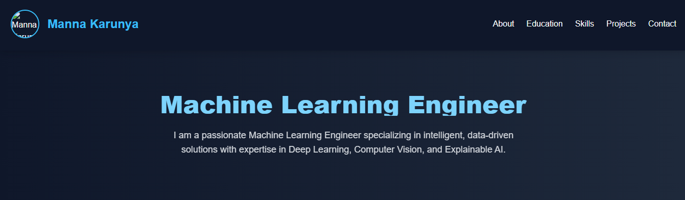

  

# 🌐 Manna Karunya — Machine Learning Engineer Portfolio  

  
  
  

This is my **personal portfolio website** showcasing my journey as a **Machine Learning Engineer**.  
It highlights my **skills, projects, experience, and education** in Artificial Intelligence and Data Science.  

---

## 🔗 Live Portfolio  
👉 [**View My Portfolio**](https://mmannakarunya-wq.github.io/Portfolio//)  

---

## 📌 Sections  

- **About Me** – Short bio and career summary  
- **Experience** – Research intern work at Sastra University  
- **Projects** – SAFE-RIDE, Explainable Deep Learning for Sigma Factors  
- **Skills** – Programming, Frameworks, Cloud, Soft Skills  
- **Education** – B.Tech AI & DS at P.A. College of Engineering and Technology  
- **Contact** – Email, LinkedIn, GitHub  

---

## 🛠️ Tech Stack  

- **Languages**: C, Python, SQL  
- **Frameworks/Tools**: TensorFlow, PyTorch, OpenCV, Scikit-learn, Pandas, NumPy, Git, YOLO, Azure, AWS  
- **Technologies**: Machine Learning, Deep Learning, Cloud Computing, Database Management Systems  
- **Soft Skills**: Communication, Adaptability, Collaboration, Time Management, Leadership  

---

## 🚀 Projects  

### SAFE-RIDE: Smart Accident Forecasting & Emotion-Based Risk Intelligent Detection Engine  
AI-powered system that predicts and prevents road accidents by analyzing **real-time video, GPS speed, and weather conditions**.  

### Explainable Deep Learning for Sigma Factors  
Deep learning-based model to identify **sigma factor-specific bacterial promoters** from DNA sequences using CNNs.  
Integrated **six explainability techniques** to interpret model predictions.  

---

## 📬 Contact  

- **Email:** m.mannakarunya@gmail.com  
- **LinkedIn:** [linkedin.com/in/mannakarunya](https://linkedin.com/in/mannakarunya)  
- **GitHub:** [github.com/mmannakarunya-wq](https://github.com/mmannakarunya-wq)  

---

⭐ If you like this portfolio, don’t forget to **star this repo**!
